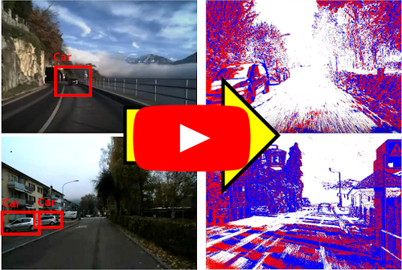

# Bridging the Gap between Events and Frames through Unsupervised Domain Adaptation

<p align="center">
  <a href="https://youtu.be/fZnBSqni6PY">
    
  </a>
</p>


This is the code for the paper **Bridging the Gap between Events and Frames through Unsupervised DomainAdaptation** 
([PDF](http://rpg.ifi.uzh.ch/docs/RAL22_Messikommer.pdf)) by Nico Messikommer, [Daniel Gehrig](https://danielgehrig18.github.io), 
Mathias Gehrig, and [Davide Scaramuzza](http://rpg.ifi.uzh.ch/people_scaramuzza.html).

If you use any of this code, please cite the following publication:

```bibtex
@InProceedings{Messikommer20ral,
  author        = {Nico Messikommer and Daniel Gehrig and Mathias Gehrig and Davide Scaramuzza},
  title         = {Bridging the Gap between Events and Frames through Unsupervised Domain Adaptation},
  journal       = {Robotics and Automation Letters. (RA-L)},
  url           = {http://rpg.ifi.uzh.ch/docs/RAL22_Messikommer.pdf},
  year          = 2022
}
```

## Abstract
Reliable perception during fast motion maneuvers
or in high dynamic range environments is crucial for robotic
systems. Since event cameras are robust to these challenging
conditions, they have great potential to increase the reliability
of robot vision. However, event-based vision has been held
back by the shortage of labeled datasets due to the novelty of
event cameras. To overcome this drawback, we propose a task
transfer method to train models directly with labeled images
and unlabeled event data. Compared to previous approaches, (i)
our method transfers from single images to events instead of
high frame rate videos, and (ii) does not rely on paired sensor
data. To achieve this, we leverage the generative event model to
split event features into content and motion features. This split
enables efficient matching between latent spaces for events and
images, which is crucial for successful task transfer. Thus, our
approach unlocks the vast amount of existing image datasets for
the training of event-based neural networks. Our task transfer
method consistently outperforms methods targeting Unsupervised
Domain Adaptation for object detection by 0.26 mAP (increase
by 93%) and classification by 2.7% accuracy.

## Installation
### Dependencies
As an initial step, the wheel package needs to be installed with the following command:
```bash
pip install wheel
```
The required python packages are listed in the `requirements.txt` file.
```bash
pip install -r requirements.txt
```

To convert the MVSEC or the One Megapixel dataset to the hdf5 format, the following compression package needs to be installed:
`https://github.com/conda-forge/blosc-hdf5-plugin-feedstock`

To use the Waymo Open Dataset, the following package needs to be installed:
`https://github.com/gdlg/simple-waymo-open-dataset-reader`

## Datasets
### Caltech101 and N-Caltech101
The paired dataset containing Caltech101 and N-Caltech101 can be downloaded [here](https://rpg.ifi.uzh.ch/data/VID2E/Paired_N-Caltech101.zip)
The dataset should have the following format:


    ├── N-Caltech101                 # Path in settings.yaml is the directory of this folder
    │   ├── accordion                # Classes as folder names
    │   │   ├── cam0_events_0001.npy 
    │   └── ...
    ├── Caltech101
    │   ├── accordion
    │   │   ├── image_0001.jpg
    │   └── ...
    ├── split_train_0.5_val_0.25_test_0.25_new
    │   ├── test.txt
    │   ├── train.txt
    │   └── val.txt
    ├── split_train_0.5_val_0.25_test_0.25_new_extended
    │   ├── test.txt
    │   ├── train.txt
    │   └── val.txt
   
As our method does not require paired frame and event data, the extened caltech101 can be used.
Thus, the splits in the `split_train_0.5_val_0.25_test_0.25_new_extended` directory are used by default.

The training splits defined in `<mode>.txt` should have the following content, where the number corresponds to the sample id in the specific class:
```bash
accordion:
- 3
- 10
...
```

### MVSEC
The MVSEC dataset can be downloaded [here](https://daniilidis-group.github.io/mvsec/).
Before training, the MVSEC dataset should be converted to hdf5, which can be done with the `datasets/export_data_from_rosbag.py` script.
The command to run the script can be found at the top of the script.

The MVSEC labels can be downloaded from the following repository:
`https://github.com/alexzzhu/EventGAN`.

The labels should be placed in the directory of the corresponding sequence:

    ├── <sequence_name> 
    │   ├── processed_data.hdf5
    │   └── labels
    │   │   ├── 00000396.txt
    │   │   ├── <frame_id>.txt
    │   │   ├── ....

The text file should have the following format:
```bash
Class Not Specified y_min, x_min, y_max, x_max
```
If necessary, the dataloader needs to be adapted according the labels provided by the EventGAN authors.

### Waymo
The Waymo Open Dataset can be downloaded [here](https://waymo.com/intl/en_us/dataset-download-terms/).

### One Megapixel Dataset
The One Megapixel Dataset can be downloaded [here](https://www.prophesee.ai/2020/11/24/automotive-megapixel-event-based-dataset/).
To use the provided dataloader, the dataset should be converted to hdf5, which can be done with the `datasets/convert_oneMP_dataset.py` script.
The compressed data can directly be converted to hdf5 by the following bash script in `datasets/decompress_convert_oneMP_dataset.sh`.
The file paths should be adjusted in the bash script.

## Training
The settings for the training should be specified in `config/settings.yaml`.
To start the training, it is necessary to replace `<path>` everywhere in the yaml file. 
If the dataset is not used, the path can also be replaced by `None`.

Two different models can be trained:
- classification_model: standard transfer model for the classification task
- object_det_model: transfer model for the object detection task

The following command starts the training: 

```bash
CUDA_VISIBLE_DEVICES=<GPU_ID>, python train.py --settings_file config/settings.yaml
```

# Acknowledgement
Several network architectures were adapted from:<br />
`https://github.com/HsinYingLee/DRIT`

The general training framework was inspired by:<br />
`https://github.com/alexzzhu/EventGAN`

The object detection network was adapted from:<br />
`https://github.com/eriklindernoren/PyTorch-YOLOv3/`

The mvsec extraction script was adapted from:<br />
`https://github.com/SensorsINI/ECCV_network_grafting_algorithm`

The optimizer was adapted from:<br />
`https://github.com/LiyuanLucasLiu/RAdam`

The ssim loss was adapted from:<br />
`https://github.com/Po-Hsun-Su/pytorch-ssim`